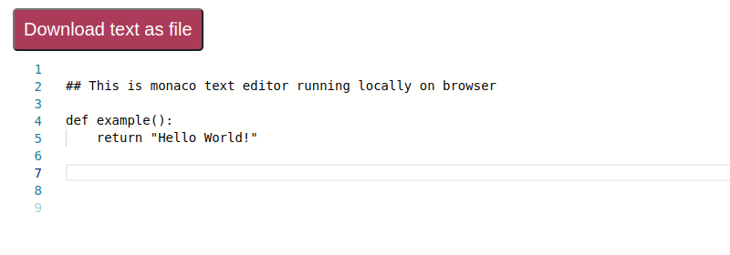

This is a simple web text editor built with Kotlin/JS and monaco editor.

The main purpose of this project is to try out Kotlin/JS.

## How to run
1. Clone the repository
2. Navigate to directory where ```build.gradle.kts``` file is located and build the project using:
```bash
./gradlew build
```
3. In one terminal, run the server part of the project using:
```bash
./gradlew run
```
4. In a seperate terminal, run the client part of the project using:
```bash
./gradlew jsBrowserDevelopmentRun
```
5. Server should start on ```localhost:8080``` and client on ```localhost:8081```

## Structure
The main logic of the server part is located in ```src/jvmMain/kotlin/org/example/application/Server.kt```

The main logic of the client part is located in ```src/jsMain/kotlin/Client.kt```

Example of the client:
